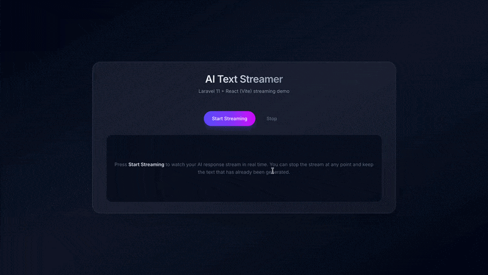

# 🚀 AI Text Streamer (Real-Time UI)

 

A production-grade prototype for streaming AI responses with zero perceived latency using **HTTP Streaming**. 

> **🎥 Demo Preview**



### ⚡ Core Tech & Architecture
- **Backend (Laravel 11):** Bypasses Nginx buffering (`X-Accel-Buffering: no`) and utilizes PHP `ob_flush` to push chunks instantly.
- **Frontend (React + Vite):** Intercepts the fetch `response.body` via `ReadableStream` to incrementally update the UI without re-rendering.
- **UI/UX:** Modern glassmorphism design with a dynamic typing cursor.

### 🛠️ Quick Start

#### Prerequisites
- PHP >= 8.2
- Composer
- Node.js >= 18.x
- npm or yarn

#### Installation

```bash
# 1. Clone the repository
git clone https://github.com/Kaung-myat-paing/ai-text-streamer.git
cd ai-text-streamer

# 2. Setup Backend
cd backend
cp .env.example .env
php artisan key:generate
composer install
php artisan serve

# 3. Setup Frontend (in a new terminal)
cd ../frontend
npm install
npm run dev
```

**Author:** Kaung Myat Paing | [LinkedIn](https://www.linkedin.com/in/kmpeg/) | [GitHub](https://github.com/Kaung-myat-paing)